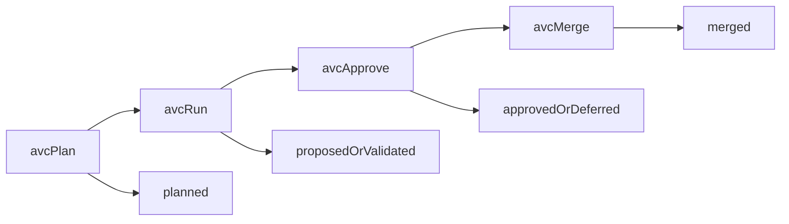

# AVC CLI Vision

## Goal

Define a CLI-first workflow where AVC becomes the primary interface for planning, executing, approving, and merging agentic changes, with Git compatibility during transition and Git-optional operation as the end state.

## Product Direction

- Near term: Git-compatible AVC commands for existing repositories.
- Mid term: Ledger-first workflows where Git is generated/output-compatible.
- Long term: Git-optional runtime where AVC is the system of record and Git is an adapter.

## Core UX Principles

- One command model for human and agent workflows.
- Explicit lifecycle checkpoints with immutable event records.
- Reviewer traceability as a first-class experience.
- Safe defaults for approvals, policy gates, and rollback readiness.

## First Command Model

### `avc plan`

Purpose:

- declare intent;
- capture constraints and acceptance criteria;
- open a new change package in the ledger.

Expected outputs:

- `change_package_id`;
- initial lifecycle checkpoint (`planned`);
- sidecar metadata initialized in `.avc/`.

### `avc run`

Purpose:

- execute agent workflows against an existing change package;
- record provider/tool actions and generated artifacts;
- produce candidate diffs and validation evidence.

Expected outputs:

- execution events;
- patch artifacts and test results;
- lifecycle checkpoint (`proposed` or `validated`).

### `avc approve`

Purpose:

- apply policy gates and human approval decisions;
- scope approvals (global or file/domain-limited);
- record conditions (for example, monitor requirements).

Expected outputs:

- approval events linked to checkpoints;
- unmet requirements if approval cannot proceed;
- lifecycle checkpoint (`approved` or `deferred`).

### `avc merge`

Purpose:

- finalize approved changes;
- emit merge result and references;
- attach deployment/runtime observation hooks.

Expected outputs:

- merge completion event;
- final references (commit/release ids);
- lifecycle checkpoint (`merged`).

## Transition Mapping to Git

During transition, each AVC command maps to familiar Git operations while preserving AVC as the lifecycle authority.


| AVC Command   | Git-Compatible Behavior               | Ledger Source of Truth      |
| ------------- | ------------------------------------- | --------------------------- |
| `avc plan`    | create branch + sidecar scaffold      | intent + plan events        |
| `avc run`     | edit files, stage changes, run checks | execution + artifact events |
| `avc approve` | annotate PR review state              | approval + policy events    |
| `avc merge`   | merge branch / fast-forward           | merge + runtime-link events |


## Example End-to-End Flow

```shell
avc plan --title "Add provider-agnostic adapter contract"
avc run --package cp_123 --agent coder --provider openai
avc approve --package cp_123 --reviewer alice --scope "auth/**"
avc merge --package cp_123
```




## Data and Filesystem Expectations (Pilot)

- Sidecar location: `.avc/`
- Suggested layout:
  - `.avc/packages/<change_package_id>/intent.json`
  - `.avc/packages/<change_package_id>/events.ndjson`
  - `.avc/packages/<change_package_id>/artifacts/`
  - `.avc/index/by-commit/<sha>.json`
- Commit references remain present for interoperability.

## Policy and Safety Baseline

- Immutable lifecycle events.
- Event creation is governed by `.avc/config.json` (field: `securityLevel`) to determine whether payloads are written as full, redacted, or summary-only.
- Security-level evaluation happens before event persistence (fail-closed if config is missing/invalid) to prevent accidental sensitive-content bleed.
- Policy gates before approval and merge.
- Rollback-ready metadata required for high-risk scopes.

## Milestones

### M1) Git-Compatible Pilot

- Implement `plan/run/approve/merge` over existing repo workflows.
- Validate reviewer traceability queries in active development.
- Measure sidecar growth, merge friction, and command ergonomics.

### M2) Ledger-First Transition

- Make CLI commands primary for day-to-day workflows.
- Auto-generate Git artifacts and PR annotations.
- Keep bidirectional mapping between ledger ids and commit ids.

### M3) Git-Optional Operation

- Support non-Git-native storage and merge semantics.
- Keep Git import/export adapters for interoperability.
- Treat Git as one backend format, not a mandatory core.

## Open Design Topics

- Command ergonomics for multi-agent runs (`avc run --parallel`).
- Conflict resolution model in Git-optional mode.
- Plugin/API contracts for custom policy gates and provider adapters.

