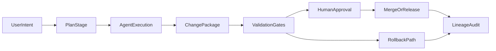

# Agentic Version Control Concept Plan

## Goal

Design a new, tool-agnostic version-control model for agentic development that:

- Handles high volumes of AI-generated changes safely.
- Maintains clear lineage across the agent lifecycle.
- Supports multiple model/tool providers consistently.
- Preserves strong human governance without slowing delivery.

## Proposed Concept: Intent-Centric Versioning

Use a layered model where commit history is augmented by an **intent and execution graph**:

- **Intent Layer**: What was requested (goal, constraints, acceptance criteria).
- **Execution Layer**: How agents acted (provider, prompts, tools, decisions, retries).
- **Change Layer**: What code/data changed (diffs, tests, artifacts).
- **Governance Layer**: Who approved/rejected and why (policies, risk, sign-offs).

This treats each change as a **traceable change package** instead of only a raw code diff.

## Core Entities

- `ChangePackage`: Unit of work linking intent, execution trace, and resulting diff.
- `LifecycleCheckpoint`: Standard states (`planned`, `executing`, `proposed`, `validated`, `approved`, `merged`, `rolled_back`).
- `ProviderAdapter`: Normalizes provider-specific metadata into a common schema.
- `PolicyGate`: Applies security/compliance/test/review rules by risk tier.
- `LineageRecord`: Immutable references connecting intent -> actions -> artifacts -> merge.

## High-Level Workflow

## Governance and Safety Defaults

- Enforce mandatory provenance fields on every change package (agent, provider, prompt hash, tool calls, test evidence).
- Require stricter policy gates for high-risk file scopes (auth, billing, infra, secrets).
- Use staged approvals: low-risk auto-merge candidates vs high-risk human-required merges.
- Attach reversible metadata to support reliable rollback and replay.

## Provider-Agnostic Design Principles

- Define one canonical event schema for lifecycle events.
- Keep provider-specific fields in adapter namespaces to prevent lock-in.
- Version the schema separately from execution engines so adapters evolve independently.
- Require capability declarations (tool-use, structured output, reasoning trace availability).

## First Implementation Slice (Single Repo)

- Introduce change-package metadata sidecar files tied to branches/PRs.
- Add lifecycle checkpoint recording in CI and local agent runs.
- Add policy gate checks that evaluate risk tier + required evidence.
- Add basic lineage views for developers/reviewers (intent, trace summary, validation status).

## Success Criteria

- Every merged change can be traced from intent to approval in one query/view.
- Provider swap does not require workflow redesign.
- Mean review time drops for low-risk agent changes while defect escape rate does not increase.
- Rollback and replay are deterministic for at least one critical workflow category.

## Risks to Manage

- Metadata overhead and developer friction.
- Inconsistent event quality across providers.
- Privacy/security concerns around prompt/tool trace retention.
- Overly strict policy gates causing delivery slowdown.

## Deliverables

- Concept note with lifecycle and data model.
- Canonical event schema draft.
- Governance policy matrix by risk tier.
- Pilot rollout plan for one repository and one team.
