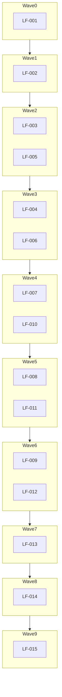
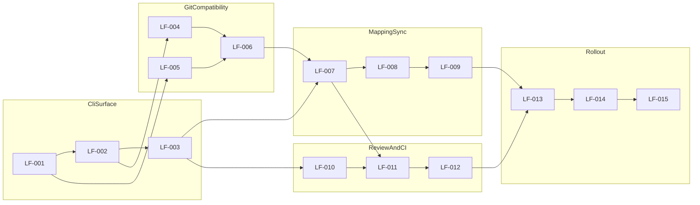

# Ledger-First CLI Ticket Order

## Purpose

This file defines precedence across Phase 2 tickets using diagram-first planning.

## Execution Sequence

## Dependency Graph

## Ticket Legend

- `LF-001` Ledger-first command defaults and mode toggles
- `LF-002` Command orchestration runtime and shared execution context
- `LF-003` CLI output contracts for ledger-first operations
- `LF-004` Git artifact emitter for branch/commit generation
- `LF-005` PR metadata emitter and compatibility annotations
- `LF-006` Deterministic Git reconciliation checks
- `LF-007` Mapping index schema (`package`, `event`, `commit`, `pr`)
- `LF-008` Bidirectional lookup commands and APIs
- `LF-009` Drift detection and mapping repair flow
- `LF-010` Review-gate integration in CLI and compatibility outputs
- `LF-011` CI/check status ingestion and merge-readiness synthesis
- `LF-012` End-to-end review + merge compatibility flow validation
- `LF-013` Feature flags, rollout controls, and fallback mode
- `LF-014` Adoption and reliability metrics for transition
- `LF-015` Phase 2 readiness report and Phase 3 entry recommendation

