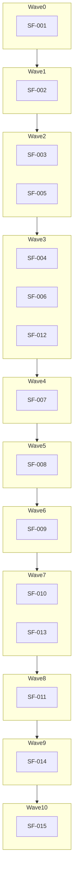
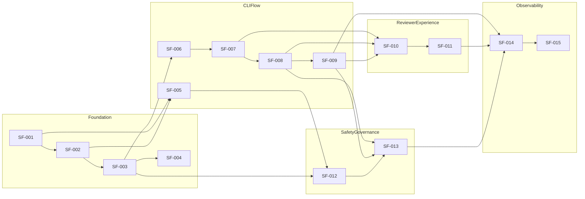

# Sidecar Foundations Ticket Order

## Purpose

This file defines precedence across all Phase 1 tickets using diagrams as the primary planning format.

## Execution Sequence

## Dependency Graph

## Ticket Legend

- `SF-001` Config contract + fail-closed loader
- `SF-002` Sidecar schema v1
- `SF-003` Event append writer + ordering guarantees
- `SF-004` Commit index update + rebuild strategy
- `SF-005` CLI core context + error/exit-code mapping
- `SF-006` `avc plan` persistence flow
- `SF-007` `avc run` execution event flow
- `SF-008` `avc approve` gate and decision flow
- `SF-009` `avc merge` finalization + index update flow
- `SF-010` Reviewer read model reducers
- `SF-011` `avc status` query and output contracts
- `SF-012` Immutable/supersedes invariant enforcement
- `SF-013` Rollback metadata + policy enforcement
- `SF-014` Metrics instrumentation and collection
- `SF-015` Workload runs + pilot readiness report

