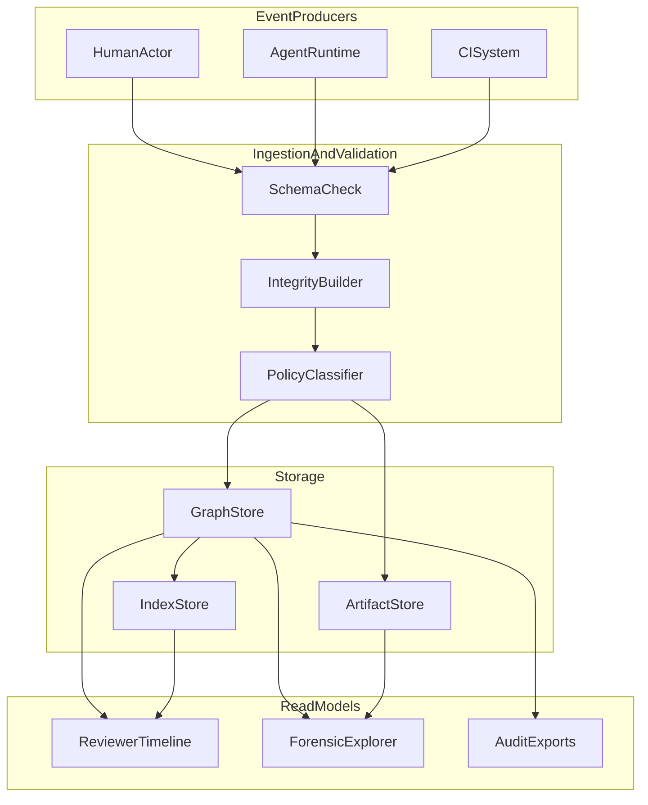
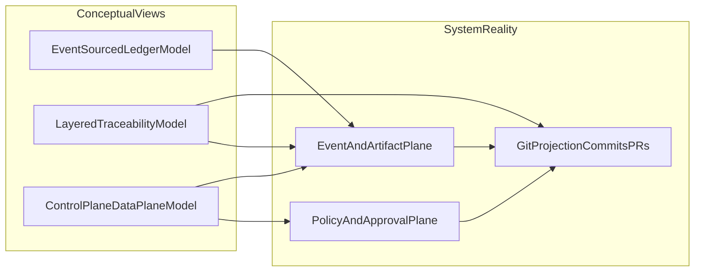

# Banana Ledger of Doom

## Q&A Session: Graph-First Modeling

### Q1) What is the core idea of this model?

Treat version control as an event graph first, with commits as one output artifact. Every lifecycle action (intent creation, planning, tool call, test run, approval, merge) is an append-only event node.

### Q2) What are the modeling layers?

- **Intent Layer**: goals, constraints, acceptance criteria.
- **Execution Layer**: agent steps, provider details, tool invocations, retries.
- **Artifact Layer**: diffs, test reports, generated files, commit references.
- **Governance Layer**: policy decisions, approvals, exceptions, audit signatures.
- **Runtime Layer**: deployment and post-merge telemetry, linked back to the same lineage.

### Q3) How does this handle multiple providers?

Use a provider adapter that maps raw provider events into canonical event types (`ModelRequest`, `ToolInvocation`, `ReasoningCheckpoint`, `Failure`). Keep provider-specific fields in a namespaced payload (`provider.raw.*`) to avoid schema lock-in.

### Q4) What are the strongest benefits?

- Maximum traceability across the full lifecycle.
- Easier replay and root-cause analysis after incidents.
- Natural support for multi-agent collaboration and forks.

### Q5) What are the main drawbacks?

- Storage and indexing overhead grows quickly.
- Query complexity can become high without strict conventions.
- Requires clear retention policies for sensitive prompt/tool data.

### Q6) What does approval look like in this model?

Approval is an event edge from reviewer identity to a specific graph checkpoint, not just a PR status bit. This allows "approved for low-risk files only" or "approved with mandatory post-merge monitor."

### Q7) Best fit?

Teams that value forensic-level lineage, compliance-heavy workflows, and long-lived agent automation.

### Q8) What does the canonical event schema look like?

Every event should contain:

- `event_id`: globally unique id (UUID or ULID).
- `change_package_id`: shared id for a single intent-to-merge flow.
- `event_type`: canonical type (`IntentDeclared`, `ToolInvocation`, `ValidationResult`, etc.).
- `actor_type`: `human`, `agent`, `system`.
- `actor_id`: concrete actor id (`agent.coder.v2`, reviewer handle, CI service account).
- `occurred_at`: event timestamp in UTC.
- `references`: pointers to commit sha, PR id, artifact ids, deployment id.
- `payload`: typed event body.
- `integrity`: event hash + previous hash for tamper evidence.

### Q9) What edge types should the graph support?

- `caused_by`: child event resulted from parent event.
- `depends_on`: event waited on another event before execution.
- `validates`: validation event proves an artifact or step.
- `approves`: reviewer event approves a specific checkpoint.
- `supersedes`: replacement for earlier event (important for redaction or retries).
- `rolls_back`: links rollback actions to original merge/deploy.

### Q10) Can we see a concrete lifecycle trace?

1. `IntentDeclared` (`change_package_id=cp_123`)
2. `PlanProposed` (agent planner)
3. `ModelRequest` (provider A)
4. `ToolInvocation` (`ReadFile`, `ApplyPatch`)
5. `DiffProduced` (links patch artifact + commit candidate)
6. `ValidationResult` (tests + static checks)
7. `ApprovalGranted` (human reviewer with scope constraints)
8. `MergeCompleted` (commit sha linked)
9. `DeployObserved` (runtime signal for same `change_package_id`)

This trace makes it easy to answer "why was this merged?" and "what exactly happened before production?"

```mermaid
flowchart LR
  intentDeclared[IntentDeclared]
  planProposed[PlanProposed]
  modelRequest[ModelRequest]
  toolInvocation[ToolInvocation]
  diffProduced[DiffProduced]
  validationResult[ValidationResult]
  approvalGranted[ApprovalGranted]
  mergeCompleted[MergeCompleted]
  deployObserved[DeployObserved]

  intentDeclared --> planProposed
  planProposed --> modelRequest
  modelRequest --> toolInvocation
  toolInvocation --> diffProduced
  diffProduced --> validationResult
  validationResult --> approvalGranted
  approvalGranted --> mergeCompleted
  mergeCompleted --> deployObserved
```

### Q11) How should query/read models be designed?

Maintain two read paths:

- **Operational view**: denormalized timeline per `change_package_id` for fast reviewer UX.
- **Forensic view**: full graph traversal for incident analysis and compliance audits.

Recommended indexes:

- `(change_package_id, occurred_at)`
- `(event_type, occurred_at)`
- `(references.commit_sha)`
- `(actor_id, occurred_at)`

### Q12) How do we prevent the graph from becoming unmanageable?

- Enforce event contracts by type with schema validation in ingestion.
- Require lifecycle checkpoints to include minimal required fields.
- Use retention classes: `full`, `redacted`, `summary_only`.
- Attach large payloads as external artifacts and store references in graph events.
- Introduce sampling for verbose runtime telemetry once stability is proven.

### Q13) What security and privacy controls are mandatory?

- Prompt/tool payload classification (`public`, `internal`, `sensitive`).
- Field-level encryption for sensitive payload segments.
- Redaction events instead of hard deletion where possible.
- Access control by role + purpose (review, audit, incident response).
- Cryptographic integrity chain verification on read for high-trust workflows.

### Q14) What should rollout look like for a single-repo pilot?

Phase 1 (minimum viable lineage):

- Capture intent, tool invocation summaries, validation, and approvals.
- Link everything to commit sha and PR id.

Phase 2 (strong governance):

- Add policy events and scoped approvals.
- Add rollback linkage and post-merge telemetry.

Phase 3 (forensic readiness):

- Add integrity chain, retention automation, and forensic query templates.
- Define SLOs for lineage completeness and ingestion latency.

### Q15) What conceptual models describe this system best?

Use these three conceptual models together:

- **Event-Sourced Ledger Model**: the source of truth is an append-only event stream with integrity links.
- **Layered Traceability Model**: intent, execution, artifacts, governance, and runtime are separate but linked layers.
- **Control-Plane/Data-Plane Model**:
  - control-plane = policies, approvals, risk rules, retention classes;
  - data-plane = events, artifacts, commit refs, telemetry.

In practice, this means we do not treat "a commit" as the whole truth. We treat it as one projection of a broader lifecycle record.

### Q16) How should we choose between conceptual models in design discussions?

- Start with **Layered Traceability** when discussing product behavior and UX.
- Switch to **Event-Sourced Ledger** when discussing storage, replay, and audit guarantees.
- Switch to **Control/Data Plane** when discussing governance, approvals, and operational ownership.

These are not competing theories; they are complementary lenses for different engineering decisions.

### Decisions and Follow-Ups

#### D1) Lifecycle immutability

Decision: lifecycle events are immutable.

Implication:

- Redaction should be modeled as a new `supersedes` event with policy-controlled visibility, not mutation/deletion of original events.

#### D2) Runtime telemetry scope (clarified)

Clarification of the original question: this asks how much production/runtime signal to attach to each `change_package_id` before the system becomes too expensive or noisy.

What "production/runtime signal" means:

- Observations from live systems after merge/deploy that indicate real-world behavior and risk.
- These are not development-time checks; they are post-deployment signals tied back to a change.

Examples:

- Deployment outcomes: `deploy started`, `deploy succeeded/failed`, environment, release id.
- Reliability shifts: error rate increase/decrease, exception spikes, saturation warnings.
- Performance shifts: latency deltas (p50/p95), throughput changes, queue depth changes.
- Safety outcomes: rollback triggered, feature flag kill switch activated, incident opened.

Starting policy:

- Capture only high-signal telemetry by default (`deploy status`, `error-rate deltas`, `latency deltas`, `rollback signal`).
- Keep detailed traces optional and sampled by risk tier.

#### D3) Event storage architecture

Decision: choose repo sidecar metadata for the pilot.

Why:

- Fastest path to validate reviewer traceability UX.
- Lowest operational overhead for a single-repo start.
- Keeps lineage transparent in branch/PR workflows while the model matures.

Follow-up:

- Track migration triggers for moving to hybrid or external event storage.
- Align sidecar schema with long-term CLI-first design.

#### D4) Day-one query priority

Decision: prioritize reviewer traceability for developer experience.

Day-one required query templates:

- "Why is this change safe to merge?"
- "What agent/tool actions produced this diff?"
- "Which validations and approvals are still missing?"

Incident replay remains phase-two once reviewer flow is stable.

#### D5) End-state product direction

Decision: the long-term goal is a CLI that can replace Git workflows.

Implication:

- Treat Git as a compatibility layer during transition, not the ultimate system boundary.